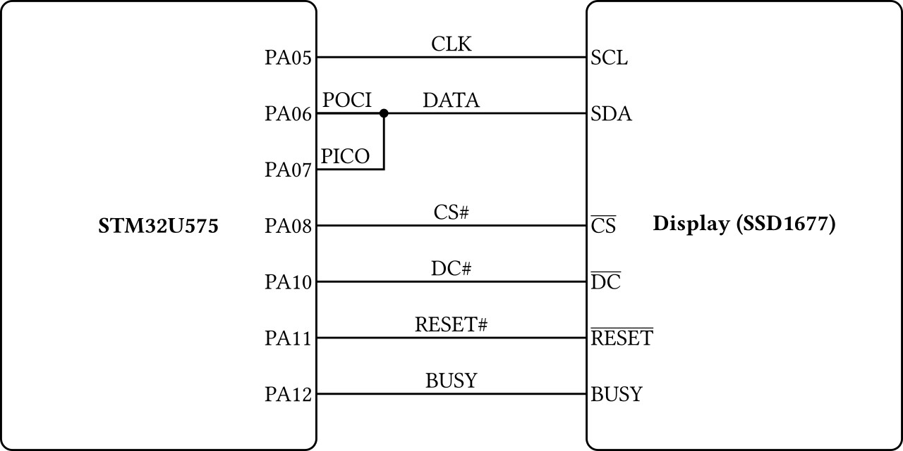
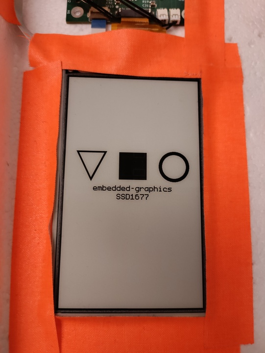
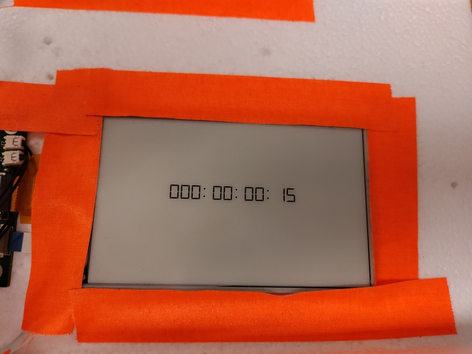

# SSD1677 Examples

This folder contains examples showing how to use the SSD1677 crate on an STM32U575 with
[Embassy](https://embassy.dev/).  

The following examples are provided:

- [Embedded Graphics Example](#embedded-graphics-example)
- [Clock Example](#clock-example)

For all examples the STM32 is connected to the display as follows:

## Embedded Graphics Example

[This example](./embedded-graphics-example/) shows a variant of the standard [Embedded Graphics Hello World Example](https://github.com/embedded-graphics/examples/blob/main/eg-0.8/examples/hello-world.rs).

## Clock Example

[This example](./clock/) shows an incrementing clock.
The clock increments once per second, and is capable of counting up to 255 days.

